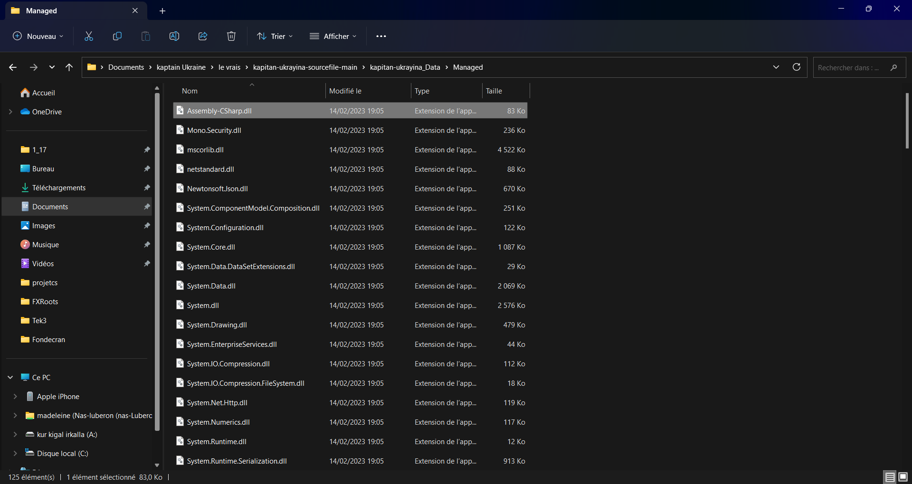
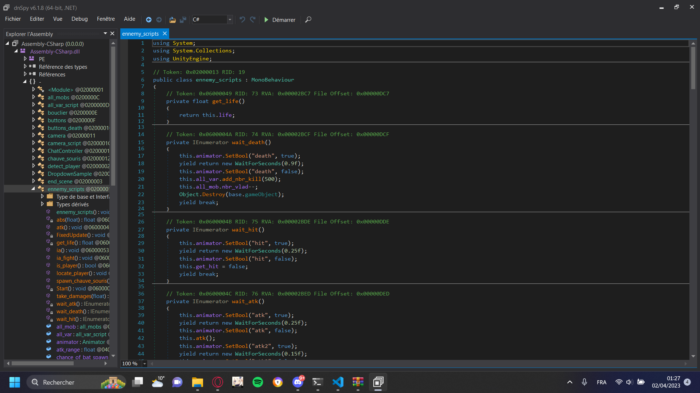

# Hub_Experience

Pour ma deuxième expérience, j'ai effectué des recherches sur la décompilation de jeux/programmes. J'ai trouvé sur Internet qu'il y avait deux types de compilation, la compilation standard, qui crée un Assembly-CSharp.dll qui contient tous les scripts du jeu/programme, et la seconde méthode est l'IL2CPP qui est beaucoup plus complexe et qui requiert une étude plus poussée du jeu/programme afin de pouvoir le décompiler.

Pour cette expérience, je me suis attardé sur la première méthode qui est la standard. En faisant plusieurs recherches sur Internet, je suis tombé sur un dépôt GitHub nommé [DnSpy](https://github.com/dnSpy/dnSpy) qui est donc un logiciel permettant de décompiler des jeux/programmes. Je l'ai donc testé sur notre merveilleux jeu [Kapitan Ukrayina](https://github.com/Mth3430/kapitan-ukrayina-build) et le logiciel m'a effectivement permis d'accéder à TOUS les scripts que nous avions faits lors de la Game Jam sur le thème Super Héros.

Voici un exemple d'utilisation:

Je cherche donc mon fichier Assembly-CSharp.dll, je fais "ouvrir avec" DnSpy et dans le logiciel :

On peut constater que j'ai bel et bien accès à tous les scripts de notre jeu et donc modifier les variables ou encore rajouter du code à notre jeu.

